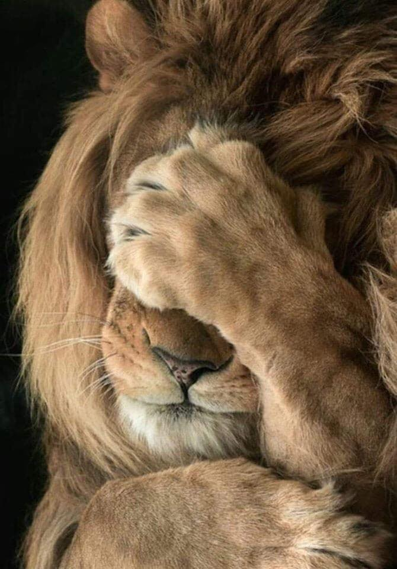

# Елена Погорелова

Мои домашние задания

## Лев

> *Лев- царь зверей.*

**Лев** (лат. Panthera leo) — вид хищных млекопитающих, один из четырёх представителей рода пантер(Panthera), относящегося к подсемейству больших кошек (Pantherinae) в составе семейства кошачьих (Felidae). Наряду с тигром — самая крупная из ныне живущих кошек, масса некоторых самцов может достигать 250 кг[2]. Трудно сказать достоверно, массивнее ли крупнейшие подвиды льва, чем крупнейшие подвиды тигров. Связано это с тем, что исторические очень крупные веса амурских тигров в большинстве своём признаны недостаточно достоверными[3]. Достаточными данными о размерах и массе представителей крупнейших подвидов льва (например, барбарийском) наука не располагает. Что касается живущих в неволе животных, они часто являют собой смешение разных подвидов. Существует мнение, что львы в неволе несколько превышают тигров в размерах и массе[4], так же как и обратное ему.

[Текст ссылки](https://commons.wikimedia.org/wiki/File:Lion_waiting_in_Namibia.jpg?uselang=ru)
